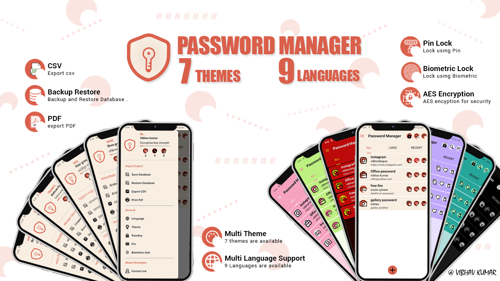
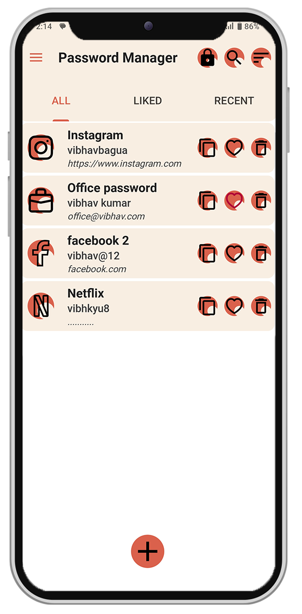
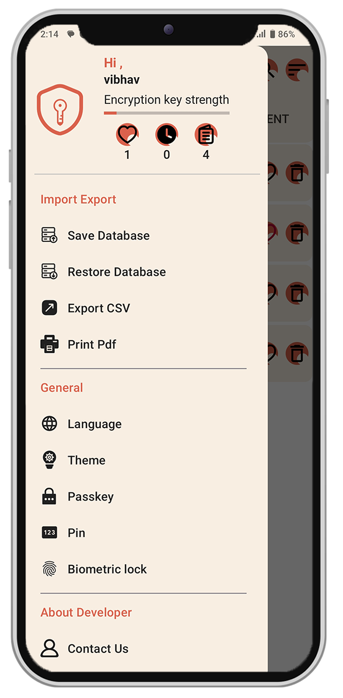
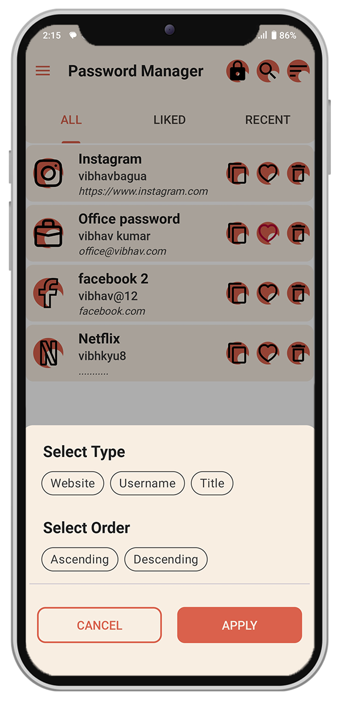
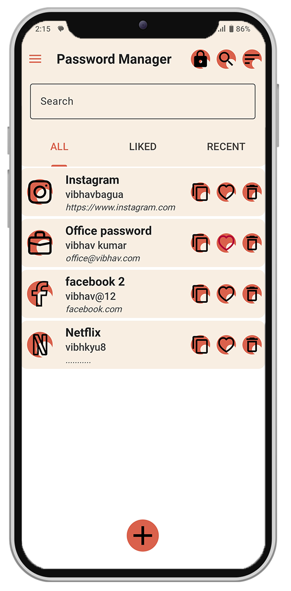
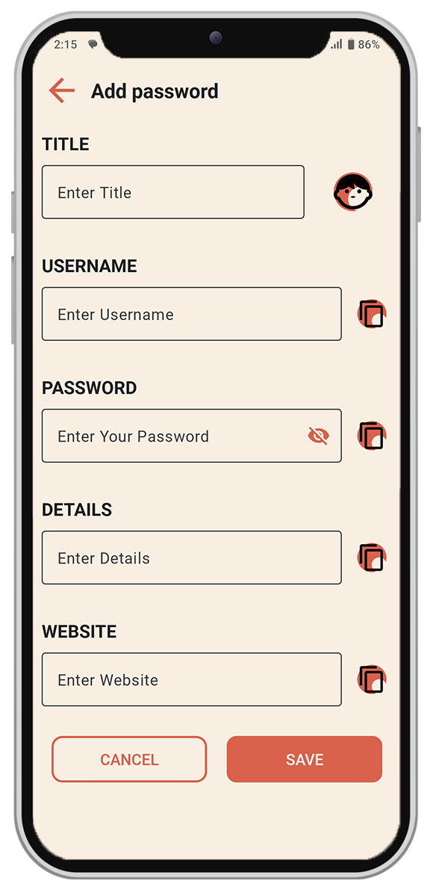
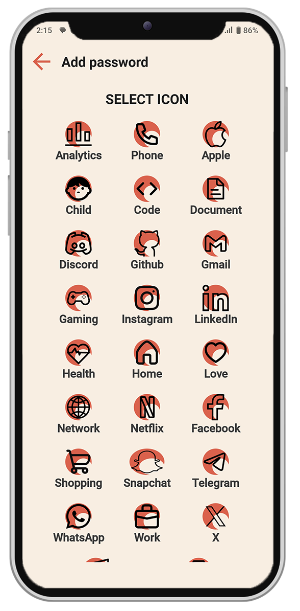
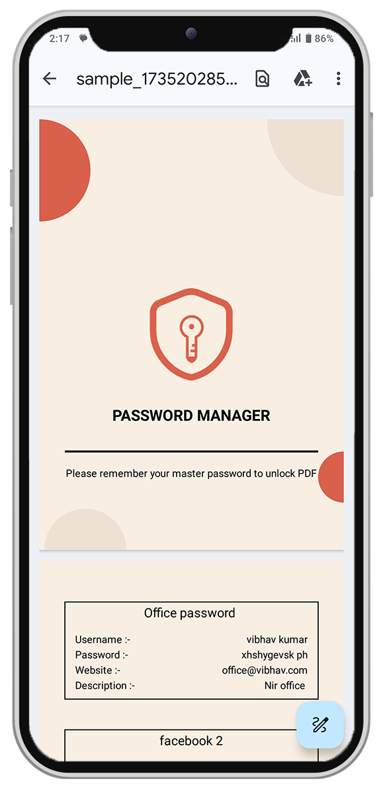
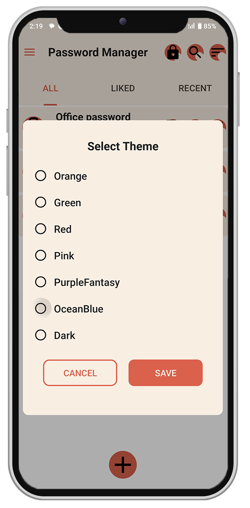
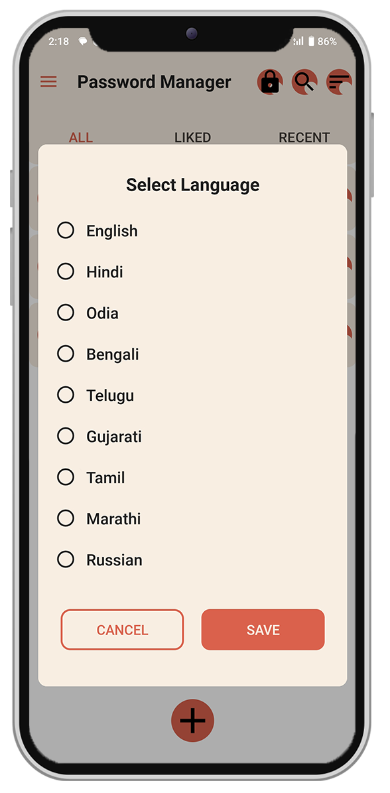

# 🔒 Password Manager App: Secure. Simple. Smart.

- 🔐 Advanced Security with AES, PIN, Biometric, and Passkey Locks ✨
- 🌍 Multi-Theme, Multi-Language, and Effortless Data Backup & Restore 🌈
- 📑 Export Passwords as PDF/CSV with Easy Search & Recent Access 🔎

## Why Password Manager? 🔐✨

This app is your ultimate password manager, offering premium features for free! We use AES encryption to securely store and manage your passwords, ensuring your data is always protected. With easy-to-use features and a focus on security, we provide:

🔐 Top-Tier Security: Enjoy AES encryption, PIN, biometric, and passkey locks to keep your passwords safe and secure. ✨
🌍 Personalized Experience: Customize your app with multiple themes 🌈, languages 🌎, and seamless backup & restore options 🔄.
📑 Effortless Management: Export passwords as PDF 📄/CSV 📊, and easily search 🔍 or access recent entries with a simple tap 🖱️.

Your passwords deserve the best protection, and we’re here to provide it—completely free! 🎉

## Different Screens 📱📲📳

Password Manager  offers a secure, sleek experience with a beautifully crafted interface. Enjoy a smooth and intuitive design across features like All Passwords, Add New Password, Saved Passwords, Password Search, Secure Backup, PIN & Biometric Lock, and more. Dive into a user-friendly, visually appealing journey to securely store, manage, and protect your sensitive information! 🔐✨

<table style="width:100%">
  <tr>
    <th>
 Home 
 </th>
    <th>
 Drawer 
</th>
    <th>
 Sort 
</th>
  </tr>
  <tr>
    <td>
 
</td>
    <td>
 
</td>
    <td>
 
</td>

  </tr>
  <tr>
    <th>
 Search
 </th>
    <th>
 Add 
</th>
    <th>
 Add Icon  
</th>
  </tr>
  <tr>
      <td>
 
</td>
    <td>
 
</td>
    <td>
 
</td>
  </tr>

  <tr>
    <th>
 Sample PDF 
 </th>
    <th>
 Theme 
</th>
    <th>
 Language  
</th>
  </tr>
  <tr>
      <td>
 
</td>
    <td>
 
</td>
    <td>
 
</td>
  </tr>
</table>

## About 🔐✨

Password Manager is the ultimate password management solution, offering premium features for free! With a focus on security, usability, and customization, this app ensures your sensitive information is safely encrypted and easily accessible. Whether you're managing a handful of passwords or dozens, Password Manager offers a seamless and visually stunning experience to keep your data protected.

🔐 Top-Tier Security Features
We use AES encryption to keep your passwords safe, ensuring top-level security. Plus, with PIN lock, biometric lock, and passkey support, you get multiple layers of protection for complete peace of mind.

🎨 Premium Customization, Free for You
Enjoy a personalized experience with multi-theme support. Choose between light, dark, or custom themes to match your preferences, all for free!

🌍 Multi-Language Support
Access the app in your preferred language for a global experience, making it easier than ever to manage your passwords.

📂 Backup & Restore Your Data
Never lose your passwords! With backup and restore functionality, you can securely save and recover your data anytime.

📑 Export Options for Flexibility
Export your stored passwords as PDF or CSV for easy access, backup, or sharing, all free of charge.

🔍 Effortless Search & Management
Quickly find and manage your passwords with advanced search and filter options. Plus, access your recent passwords with just a tap.

🛠️ Powerful Development Features
Built with NDK for improved performance and offering both release and debug builds, this app is designed for reliability. A custom package name ensures a unique, conflict-free experience.

## video 📺💻

Watch it on Youtube ............

# Working / Workflow 💪⚒

## 🔑 Password Management

- Goto Create Password page.
- Add your credentials and password.
- The app generates an encryption key using NDK for added security.
- Your password is encrypted and securely saved in the database.
- When you view the password, it is decrypted in real-time and displayed to you.
- The encryption/decryption key is stored in C++ code using NDK, ensuring enhanced security.

## 🎨 Theme Customization

- All colors are accessed using attributes (e.g., ?attr/myPrimaryColor) rather than being hardcoded.
- Depending on the selected theme, colors change dynamically, providing a multi-theme experience.
- The selected theme is saved in Shared Preferences, ensuring it persists across sessions.

## 🌍 Multi-Language Support

- All app text is stored in string resource files instead of being hardcoded.
- Text is accessed using references like @string/click.
- When a language is selected, the app updates all text dynamically.
- The selected language is stored in Shared Preferences for consistent localization.

## 📂 Backup & Restore

- The app’s database is securely stored in the app directory.
- Backup Process:
    - The app creates a copy of the database and saves it in the Downloads directory with a timestamp.
- Restore Process:
    - The selected backup file is copied back to the app’s directory, restoring all data seamlessly.

## 📑 PDF/CSV Export

- All stored passwords are retrieved and organized into a list.
- PDF Export:
    - Passwords are written onto canvas pages, styled, and converted into a PDF file.
    - The PDF is saved in the user’s Downloads directory.
- CSV Export:
    - Passwords are formatted into rows and columns and saved as a CSV file in the Downloads directory.

## 🔐 Passkey, PIN, and Biometric Lock

- Unlock the app using either a Passkey, PIN, or Biometric Authentication.
- The Passkey acts as a master password and is always active.
- Only one of PIN or Biometric Lock is active at a time.
- Credentials like PINs and passwords are securely stored in Shared Preferences, protected using AES encryption.
- This ensures robust security and keeps your data safe from unauthorized access.

## Technologies Used 👩‍💻⚙👨‍💻

- ### [mvvm ]

    - MVVM stands for Model-View-ViewModel, which is a software architectural pattern commonly used in modern UI frameworks, including Android development. In MVVM, the application is divided into three main components:

        1.  Model: Represents the data and business logic of the application.
        2.  View: Represents the UI components visible to the user.
        3.  ViewModel: Acts as an intermediary between the View and the Model, providing data and behavior to the View while
        4.  abstracting away the underlying business logic.

    - MVVM promotes separation of concerns, making it easier to maintain and test the codebase. It also facilitates reusability of components and promotes a more modular architecture.

- ### [ LiveData ]
    - LiveData is a lifecycle-aware data holder class in Android Jetpack. It ensures that your UI observes only the latest data changes and reacts accordingly, reducing the risk of memory leaks. LiveData automatically updates the UI when the underlying data changes, making it an essential component in the MVVM architecture.
    - It works seamlessly with ViewModel, helping to keep the UI and business logic separate.
- ### [NDK (Native Development Kit)]
    - The Android Native Development Kit (NDK) is a toolset that allows developers to write portions of their app using native code languages like C and C++. It provides performance advantages by leveraging native libraries and components for computationally intensive tasks.
    - The NDK is particularly useful for tasks like game development, cryptography, and real-time audio or video processing.
- ### [Room Database]
    - Room is a part of the Android Jetpack suite and provides a robust abstraction layer over SQLite to help developers build a database with minimal boilerplate code.
    - It ensures compile-time verification of SQL queries, supports LiveData for observing database changes, and integrates seamlessly with Kotlin Coroutines for asynchronous data operations.
- ### [AES Encryption]
    - AES (Advanced Encryption Standard) is a secure and widely used encryption algorithm. In Android development, AES encryption can be used to secure sensitive data like passwords, tokens, or any confidential user information.
    - By using libraries such as javax.crypto or androidx.security.crypto.EncryptedSharedPreferences, developers can implement AES encryption to enhance the security of their applications.

---

[mvvm]: https://www.geeksforgeeks.org/mvvm-model-view-viewmodel-architecture-pattern-in-android/
[Retrofit ]: https://github.com/square/retrofit
[LiveData ]: https://developer.android.com/topic/libraries/architecture/livedata
[Room Database]: https://developer.android.com/jetpack/androidx/releases/room
[AES Encryption]: https://en.wikipedia.org/wiki/Advanced_Encryption_Standard
[NDK (Native Development Kit) ]: https://developer.android.com/ndk
